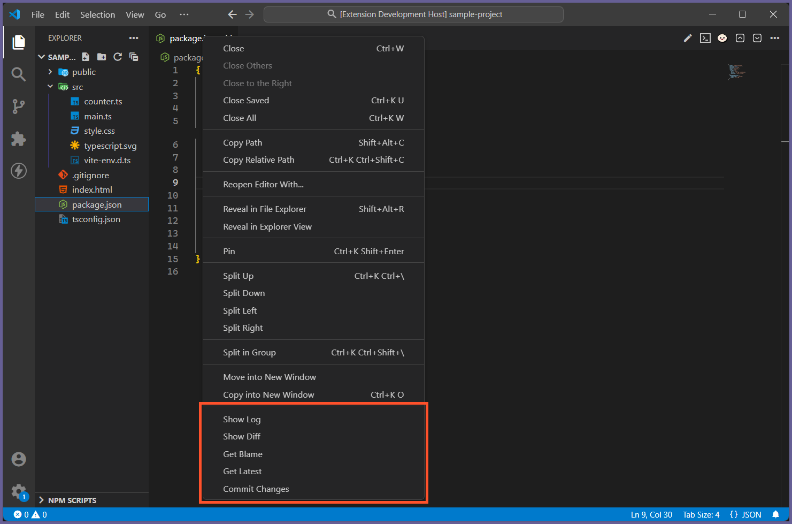

<h1 align="center">
	 
	
	  
	Tortoise SVN Tools
	  
</h1>

Tortoise SVN Tools is a VS Code extension that adds a set of context menu items to the Editor Title Bar to help with TortoiseSVN.

<h2>Table of Contents</h2>

<ul>
	<li><a href="#features">Features</a></li>
	<li><a href="#settings">Settings</a></li>
	<li><a href="#changelog">Changelog</a></li>
	<li><a href="#related">Related</a></li>
</ul>

<h2 id="features">Features</h2>

<h3>Context Menu Items</h3>

<h4>The Editor Title Bar's right-click context menu items will have the following items:</h4>

<ul>
	<li><b>Show Log</b> - Shows the log for the current file.</li>
	<li><b>Show Diff</b> - Shows the diff for the current file.</li>
	<li><b>Get Blame</b> - Show the blame viewer for the current file.</li>
	<li><b>Get Latest</b> - Updates the file to the latest version.</li>
	<li><b>Commit Changes</b> - Commits your changes to the current file.</li>
</ul> 

<h2 id="settings">Settings</h2>

<table>
	<thead>
		<tr>
			<th>Name</th>
			<th>Description</th>
			<th>Options</th>
		</tr>
	</thead>
	<tbody>
		<tr>
			<td><code>TortoiseSVNTools.hideShowLog</code></td>
			<td>Hides the <b>Show Log</b> context menu item.</td>
			<td>
				<code>true</code> 
				<code>false</code><i>(default)</i>
			</td>
		</tr>
		<tr>
			<td><code>TortoiseSVNTools.hideShowDiff</code></td>
			<td>Hides the <b>Show Diff</b> context menu item.</td>
			<td>
				<code>true</code> 
				<code>false</code><i>(default)</i>
			</td>
		</tr>
		<tr>
			<td><code>TortoiseSVNTools.hideGetBlame</code></td>
			<td>Hides the <b>Get Blame</b> context menu item.</td>
			<td>
				<code>true</code> 
				<code>false</code><i>(default)</i>
			</td>
		</tr>
		<tr>
			<td><code>TortoiseSVNTools.hideGetLatest</code></td>
			<td>Hides the <b>Get Latest</b> context menu item.</td>
			<td>
				<code>true</code> 
				<code>false</code><i>(default)</i>
			</td>
		</tr>
		<tr>
			<td><code>TortoiseSVNTools.hideCommitChanges</code></td>
			<td>Hides the <b>Commit Changes</b> context menu item.</td>
			<td>
				<code>true</code> 
				<code>false</code><i>(default)</i>
			</td>
		</tr>
	</tbody>
</table>

<h2 id="changelog">Changelog</h2>

See [CHANGELOG](CHANGELOG.md) for more information.

<h2 id="related">Related</h2>

<a href="https://marketplace.visualstudio.com/publishers/ztessema">Other VS Code extensions that I've created</a>